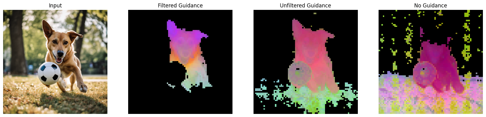

# PCA Object Recognition



In the [DINOv2 paper](https://arxiv.org/abs/1706.03762), the authors use PCA as a form of foreground masking for objects in images. In practice I found this to be unreliable for complex images and scenes with multiple different object classes.

To improve segmentation and extend foreground separation to object class detection, this repo employs the use of synthetic data and PCA filtering to extract sample tokens. These curated tokens can then be used in PCA with new complex images for dense object detection.

Although similar in approach to examples in the paper, this methodology appears to increase output quality.

## Installation and Setup

The example code can be found in the `notebook.ipynb` file. The notebook should install the necessary dependencies for you, but you can also run `pip install requirements.txt` yourself manually.

This code does require a CUDA capable device. During local testing I was able to fit everything onto an RTX 4090.

You can also optionally run `pip install xformers` if your hardware supports xformers memory efficient attention.

## References

```bibtex
@misc{oquab2023dinov2,
      title={DINOv2: Learning Robust Visual Features without Supervision}, 
      author={Maxime Oquab and Timothée Darcet and Théo Moutakanni and Huy Vo and Marc Szafraniec and Vasil Khalidov and Pierre Fernandez and Daniel Haziza and Francisco Massa and Alaaeldin El-Nouby and Mahmoud Assran and Nicolas Ballas and Wojciech Galuba and Russell Howes and Po-Yao Huang and Shang-Wen Li and Ishan Misra and Michael Rabbat and Vasu Sharma and Gabriel Synnaeve and Hu Xu and Hervé Jegou and Julien Mairal and Patrick Labatut and Armand Joulin and Piotr Bojanowski},
      year={2023},
      eprint={2304.07193},
      archivePrefix={arXiv},
      primaryClass={cs.CV}
}
```